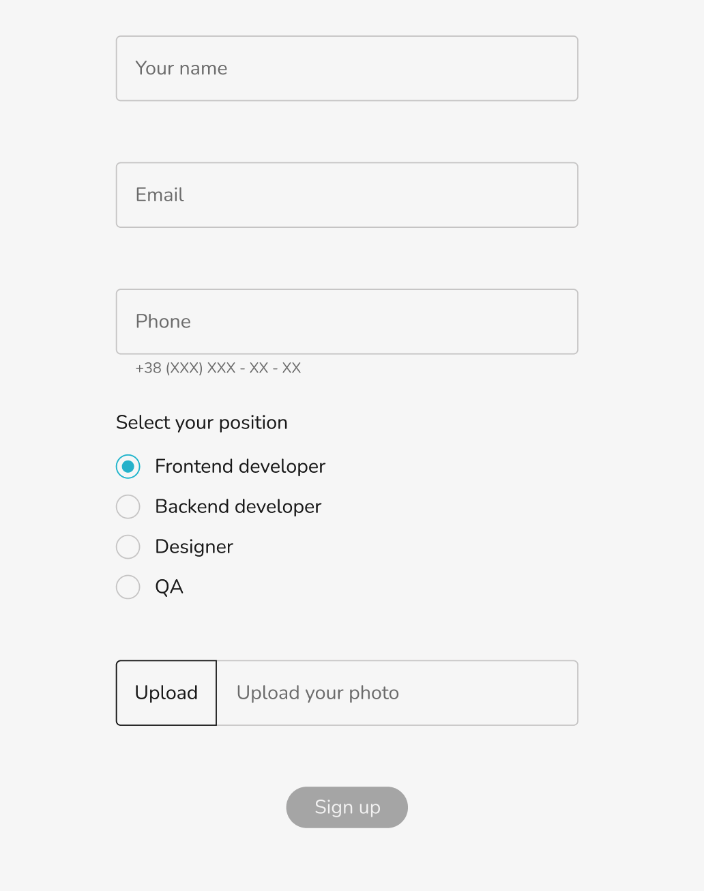

<h1>Testtask</h1>

<h3>Design:</h3>

Multi-device layouts.

<h3>Functional:</h3>

Working with REST API (GET). You will find API documentation (OpenAPI) here.

a. Implement the “Working with a GET request” block according to the mockup and API
documentation. Display 6 users on the API request result page. The "Show more" button
should be hidden when the last page of API query results is reached. Users are sorted by
registration date (the newest first).

b. To display radio buttons on the registration form, use the GET /positions method from the API documentation.

Working with REST API (POST) – registration form block “Working with a POST Request”

a. Implement front-end validation in accordance with mockups and API documentation.

b. Implement the business logic of the registration form in accordance with mockups and API documentation.

c. After successful registration, update the list of users in the “Working with a GET request” block.

If the “Show more” button has been clicked (i.e. more than one page of users has been loaded from the API), collapse all and display only the first page of the result of the GET request. As a result, the new user will be displayed first and you will be able to check the correctness of the form without reloading the page.

<h3>The tech stack is:</h3>
<ul>
<li><a href="https://en.wikipedia.org/wiki/HTML5" rel="nofollow">HTML5</a></li>
<li><a href="https://en.wikipedia.org/wiki/Cascading_Style_Sheets" rel="nofollow">CSS3</a></li>
<li><a href="https://en.wikipedia.org/wiki/CSS_Flexible_Box_Layout" rel="nofollow">Flexbox</a></li>
<li><a href="https://sass-lang.com/" rel="nofollow">Sass (Scss)</a></li>
<li><a href="https://en.bem.info/methodology/" rel="nofollow">BEM methodology</a></li>
<li><a href="https://reactjs.org/" rel="nofollow">React</a></li>
<li><a href="https://reactjs.org/docs/hooks-intro.html" rel="nofollow">React Hoocks</a></li>
<li>Rest API</a></li>
<li><a href="https://eslint.org/" rel="nofollow">ESLint</a></li>
<li><a href="https://webpack.js.org/" rel="nofollow">Webpack</a></li>
<li><a href="https://babeljs.io/" rel="nofollow">Babel</a></li>

</ul>

<h2>Author</h2>
<ul>
<li>Yuliia Tokarieva</li>
</ul>
